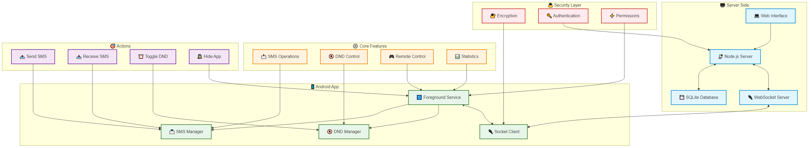

# 📱 SMS BotNet

## 🌟 Overview

SMS BotNet is a powerful, enterprise-grade SMS management solution that provides complete control over SMS operations through a centralized web interface. Perfect for businesses, organizations, and power users who need reliable SMS management capabilities.

## ✨ Key Features

### 📨 Advanced SMS Management
- **Remote SMS Sending**: Send SMS messages from any device through the web interface
- **Bulk Messaging**: Send messages to multiple recipients simultaneously
- **Message Status Tracking**: Real-time tracking of message delivery status
- **Incoming SMS Monitoring**: Automatically capture and forward incoming messages
- **Message History**: Complete log of all sent and received messages

### 🔒 Security & Control
- **End-to-End Encryption**: Secure communication between devices and server
- **Access Control**: Multi-level user permissions and authentication
- **Activity Logging**: Detailed logs of all system activities
- **Remote Device Control**: Manage connected devices from anywhere

### 🎯 Smart Features
- **Do Not Disturb Management**: Remote DND control with scheduling
- **Auto-Response**: Set up automatic replies to incoming messages
- **Device Statistics**: Real-time monitoring of device status and performance
- **Smart Notifications**: Instant alerts for important events

### 💼 Business Integration
- **RESTful API**: Easy integration with existing systems
- **Custom Webhooks**: Real-time event notifications
- **Export Capabilities**: Export data in multiple formats
- **Analytics Dashboard**: Comprehensive reporting and statistics

### 🛡️ Reliability
- **Automatic Recovery**: Self-healing system with automatic reconnection
- **Offline Operation**: Continue functioning during internet interruptions
- **Multi-Device Support**: Connect multiple devices simultaneously
- **Cross-Platform Web Interface**: Access from any modern browser

## 🚀 Use Cases

### 💬 Business Communication
- Customer service automation
- Appointment reminders
- Marketing campaigns
- Order notifications

### 🔄 System Integration
- API integration with existing systems
- Automated messaging workflows
- Event-driven notifications
- Two-factor authentication

### 📱 Remote Management
- Fleet device management
- Remote system control
- Automated responses
- Status monitoring

## 💫 Why Choose SMS BotNet?

- **Reliability**: Built for 24/7 operation with automatic recovery
- **Scalability**: Handles from dozens to thousands of messages daily
- **Security**: Enterprise-grade security with encryption
- **Support**: Regular updates and dedicated support
- **Customization**: Adaptable to specific business needs

## 📊 Performance

- **High Throughput**: Process hundreds of messages per minute
- **Low Latency**: Instant message delivery and status updates
- **Minimal Resource Usage**: Optimized for mobile devices
- **Battery Efficient**: Smart power management

## 🔧 Technical Specifications

- **Android Version**: 8.0 (API 26) and above
- **Server**: Node.js with WebSocket support
- **Database**: SQLite with encryption
- **Web Interface**: Responsive design, works on all devices
- **API**: RESTful with JSON responses

## 📞 Support & Contact

For inquiries, custom development, or support:

- 💬 Telegram: [@contact](https://t.me/Contact255Bot)

## 🎥 Demo & Documentation

- 📺 [Watch Demo Video](https://example.com/demo)
- 📚 [Full Documentation](https://example.com/docs)
- 🛠️ [API Reference](https://example.com/api)

## 💎 Premium Features

- **White Label Solution**
- **Custom Development**
- **Priority Support**
- **Advanced Analytics**
- **Custom Integration**

## 🔐 Licensing

This is a commercial product. Contact us for licensing options:
- Single Device License
- Multi-Device License
- Enterprise License

## 🎨 Customization Options

### 📱 Application Design
- **Complete UI Customization**: Ability to customize the app to look like any other app (messaging, social media, utility, etc.)
- **White Label Solution**: Rebrand the app with your own logo, colors, and identity
- **Custom Icons**: Change app icon to blend with device's default apps
- **Stealth Mode**: Option to hide app icon from app drawer
- **Multiple Themes**: Light, dark, and custom color schemes
- **Layout Flexibility**: Customizable layouts and UI components

### 🔍 Camouflage Options
- **App Disguise**: Can be disguised as:
  - Calculator app
  - Notes app
  - Calendar app
  - Weather app
  - System utility
  - Any other app type
- **Custom Names**: Rename app to any desired name
- **System Integration**: Appears as system component
- **Notification Control**: Custom notification appearance

### 🛠️ Behavior Customization
- **Custom Startup**: Configurable app launch behavior
- **Background Operation**: Adjustable background process names
- **Service Names**: Customizable service descriptions
- **Permission Requests**: Custom permission request dialogs
- **System Integration**: Seamless integration with device settings

---

  
Built with ❤️ for reliability and performance

  
© 2025 SMS BotNet. All rights reserved.

